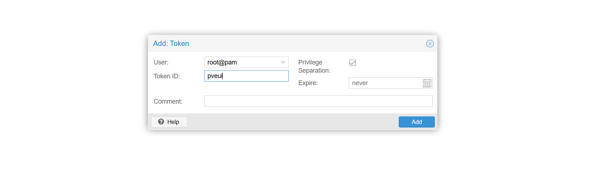

# 部署快速指南

## 先决条件
- 一台 Linux/Windows 主机或虚拟机，可以使用虚拟机或者物理主机。
- 已安装 Git（用于克隆代码）。

## 1. 克隆仓库
```bash
git clone https://github.com/niezhicheng/pveui.git
cd pveui
```

## 2. 安装 Docker

详见 https://docs.docker.com/engine/install/

## 3. 设置 Docker 镜像

- CentOS 7/8 / Ubuntu（通用）：
```bash
curl -fsSL https://get.docker.com | bash -s docker --mirror Aliyun
# 设置开机自启并启动 Docker
sudo systemctl start docker
sudo systemctl enable docker
```

```base
# 验证 Docker 是否安装成功
docker --version
```

## 4. 安装 Docker Compose

- CentOS 7/8 / Ubuntu（通用）：

- 获取最新版本：
https://github.com/docker/compose/releases

```bash
# 以5.0.1版本为例
sudo curl -L "https://github.com/docker/compose/releases/download/v5.0.1/docker-compose-$(uname -s)-$(uname -m)" -o /usr/local/bin/docker-compose
sudo chmod +x /usr/local/bin/docker-compose
# 验证安装
docker-compose --version
```

## 5. 启动服务

启动服务
```bash
# 在仓库根目录（包含 docker-compose.yml）执行
docker compose up -d
```

## 6. 访问应用

- 打开浏览器访问: http://<服务器IP>:8012
- 默认账号：admin  密码：admin123

登陆后请及时修改默认密码以保障安全。

## 7. 获取Token

### 生成Token

- 进入PVE Web界面，选择“Datacenter”->“权限 (Permissions)”->“API令牌 (API Tokens)”，点击“添加 (add)”。
- 设置“用户 (User)”和“Token ID”

- 点击“增加 (Add)”后会生成“Token Secret”，请妥善保存。

### 授权

已生成的Token没有任何权限，需要为其分配权限。

- 选择“Datacenter”->“权限 (Permissions)”
- 点击“增加 (Add)”->“API Token 权限 (API Token Permission)”
- 选择刚才创建的Token，设置路径为“/”，角色选择“管理员 (Administrator)”，点击“添加 (Add)”。
  


## 8. 连接PVE服务器

确保PVE服务器的管理IP与本机网络可达，两者最好在同一IP段，如PVE服务器IP为192.168.1.1，本机IP为192.168.1.X。

点击“PVE管理”->“PVE服务器管理”->“新增服务器”，填入PVE服务器的名称、服务器地址、端口（默认8006）、Token ID和Token Secret。


填写完成后，点击“确定”即可添加PVE服务器。

添加成功后，可以单击“测试连接”验证连接是否成功。